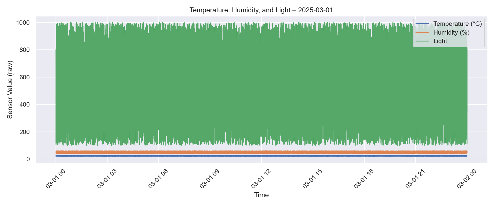
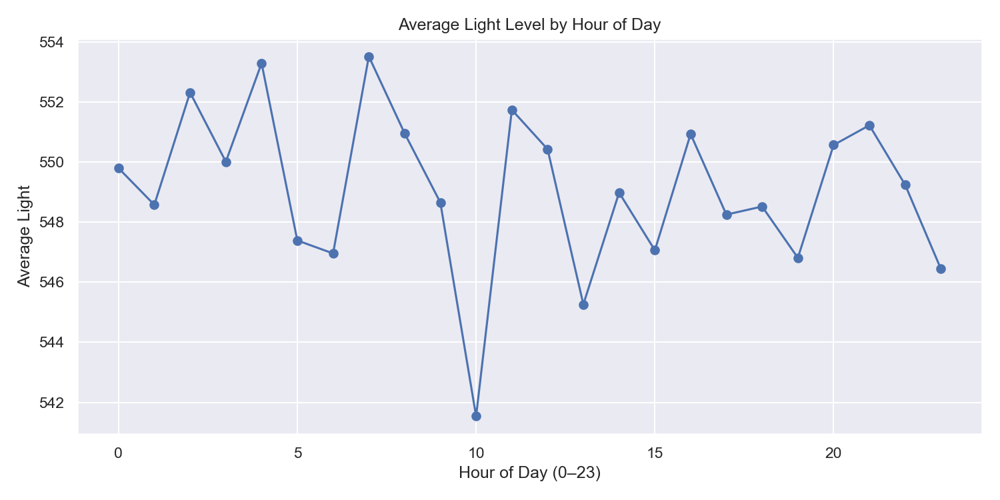
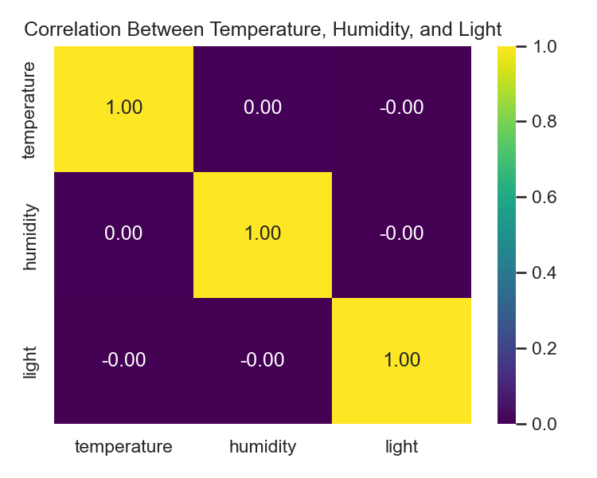

# Smart City Sensor Data – Exploratory Data Analysis (EDA)

 1. Project Overview
This project analyzes IoT sensor data collected at 5-second intervals over one week.  
The dataset is aimed at improving smart city monitoring and understanding environmental trends.

 Sensor Measurements:
- Temperature
- Humidity
- Light
- pH
- Electrical Conductivity (EC)

  Data Source: 
Grant No. BR24992852 – “ Intelligent models and methods of Smart City digital ecosystem for sustainable development and the citizens’ quality of life improvement ”

---

 2. Project Structure

SmartCityEDA/
├─ data/                 # CSV files (one per day)
├─ plots/                # Automatically saved charts
├─ smart_city_eda.ipynb  # Jupyter notebook (EDA)
└─ README.md             # report

 3. Steps in EDA (Notebook Summary)

Load and combine all CSV files

View .info() and .describe()

Handle time column → Extract date and hour

Plot temperature, humidity, and light over time

Identify day–night light cycle using hourly averages

Compute correlations between sensors

Calculate mean, min, max, and variance for each sensor

Save plots automatically for the README

4. Key Observations

4.1 Daily Behaviour of Sensors

The light sensor clearly shows a day–night cycle: values are very low during the night and rise sharply during daytime hours.

Temperature increases during the day and drops at night, following a realistic environmental pattern.

Humidity tends to be higher at night and lower during the warmest periods, showing the expected interaction between air temperature and moisture.

 4.2 Hourly Patterns Across the Week
When averaging by hour over all days, light peaks between late morning and mid-afternoon**, matching typical sunlight intensity.

Temperature also peaks around the same hours, confirming that higher light exposure is linked to higher temperature.

Humidity dips during the hottest hours, then recovers later in the evening and at night.

 4.3 Correlation Between Temperature, Humidity, and Light
 There is a negative relationship between temperature and humidity: as temperature rises, humidity generally decreases.
 
 There is a positive relationship between temperature and light: brighter periods tend to be warmer.

Humidity and light show an inverse relationship**, meaning bright, sunny hours are often less humid than cooler, darker periods.

These correlations support the idea that the sensors are capturing realistic physical behaviour and can be trusted for further analysis or predictive modelling.

 4.4 Sensor Statistics and Stability
Temperature, humidity, and light** show meaningful variation over time, which is expected in a real environment.

pH and electrical conductivity (EC) remain relatively stable over time, which suggests that the monitored medium (e.g., water or soil) is under controlled conditions.

 No extreme outliers were observed in the main variables, so the dataset is suitable for modelling, forecasting, or anomaly detection.

4.5 Overall Conclusion
The EDA confirms that:

The IoT sensor network is working correctly and capturing consistent environmental patterns.

The data reflects **natural daily cycles (day vs night, warm vs cool, dry vs humid).

The dataset is a good foundation for future smart-city applications**, such as:
  - Environmental monitoring dashboards  
  - Early-warning systems  
  - Energy and irrigation optimization  
  - Time-series forecasting models

5. Sample Plots

Below are examples of the saved plots from the notebook:

Daily Trend (Temperature, Humidity, Light)

Hourly Light Pattern

Correlation Heatmap

6. Conclusions

IoT sensors are reliable for real-time monitoring.

Environmental changes follow natural daily cycles.

Data can be used for prediction models, climate monitoring, and smart city planning.

7. Technologies Used

| Tool                 | Purpose       |
| -------------------- | ------------- |
| Python 3.10          | Programming   |
| pandas               | Data handling |
| matplotlib & seaborn | Visualization |
| VS Code              | Development   |
| Jupyter Notebooks    | EDA           |

8. Future Work

Add machine learning for anomaly detection

Build a dashboard using Streamlit or Flask

Predict humidity or temperature trends using time-series models

9. How to Run

 Create virtual environment

python -m venv .venv

 Activate virtual environment

..venv\\Scripts\\Activate.ps1

 Install dependencies

pip install pandas matplotlib seaborn

 Open the notebook in VS Code

smart_city_eda.ipynb

